# 🌿 The Conscious Closet

## The Problem

The fashion industry produces **92 million tons** of textile waste annually, uses **2,700 liters of water** for a single cotton shirt, and generates **10% of global carbon emissions**. Most people want to do better but don't know where to start.

## The Solution

**The Conscious Closet** is an educational platform that helps people learn about sustainable fashion, discover ethical brands, and take action. Built on AWS serverless infrastructure, it scales from 50 to 50,000 users at under $15/month.

🔗 **Live Site (Full Platform)** — Available on Request

---

## Origin

Started as a class project for **ITIS 3135** at UNC Charlotte → [Original static site](https://webpages.charlotte.edu/jlutabin/assets/itis3135/project/). Migrated to a full-stack AWS cloud application.

| Before | After |
|--------|-------|
| Static HTML on GitHub Pages | Next.js on AWS Amplify |
| No backend — forms showed `alert()` | API Gateway + Lambda + DynamoDB |
| No auth | Cognito with JWT tokens |
| No database | DynamoDB (2 tables + GSI) |
| Manual deploys | Git push → auto-deploy |

Inspired by Elizabeth L. Cline's book [*The Conscious Closet*](https://www.elizabethclinebooks.com/the-conscious-closet).

---

## Tech Stack

**Frontend:** Next.js 15 · React 19 · TypeScript · Tailwind CSS v4

**Backend:** AWS Lambda (Node.js 22.x) · API Gateway · DynamoDB

**Auth:** AWS Cognito · JWT tokens

**Infra:** Amplify · S3 · CloudFront · SNS · Route 53

---

## Features

**Platform** — 9 pages, 20 searchable sustainable brands with tag filtering, events calendar, rotating quotes, modern UI with Playfair Display + DM Sans typography, and entrance animations

**User Accounts** — Email signup with verification, login, password reset, profile dashboard with submission history, and saved brands

**API** — 6 serverless endpoints handling submissions, brand saving, and user data

**Notifications** — SNS email alerts for new submissions and signups

---

## Security

**Auth** — Cognito-managed password hashing, SRP protocol (passwords never sent in plain text), email verification required, JWT-secured API routes

**Sanitization** — All inputs sanitized client-side and server-side: HTML tags stripped, dangerous characters removed, field length limits enforced (name: 100, email: 254, idea: 2000)

**Rate Limiting** — 5 submissions/day per user, 5 login attempts before lockout, 3 verification resends per session, API Gateway throttling at 10 req/sec, max 50 saved brands

**Infrastructure** — Private S3 bucket with OAC, IAM least privilege, MFA on root, HTTPS everywhere, billing alerts at $10 and $25

---

## Architecture

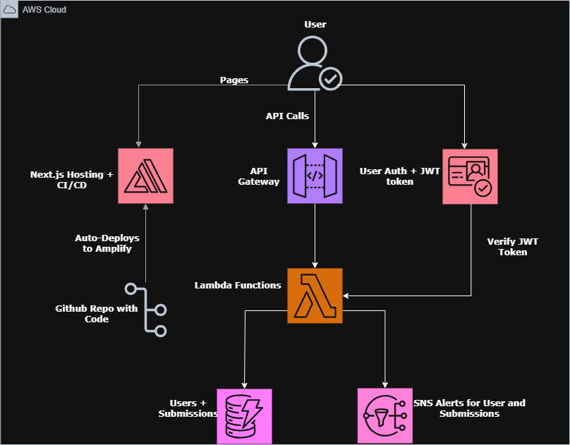

---

## Getting Started

```bash
git clone https://github.com/jtlutabingwa/concious-closet-2.0.git
cd concious-closet-2.0
npm install
npm run dev
```

> **Note:** Frontend runs locally with full navigation. Submissions, auth, and brand saving require the AWS backend which is configured separately.

---

## Database

**Submissions** — `submissionid` (PK), `userID` (GSI), `name`, `email`, `idea`, `eventDate`, `createdAt` (GSI sort), `status`

**Users** — `userID` (PK, Cognito sub), `displayName`, `email`, `campus`, `joinedAt`, `sustainabilityScore`, `savedBrands` (max 50), `completedActions`

---

## Roadmap

- [x] AWS cloud migration (S3, CloudFront, Amplify)
- [x] Serverless API (Lambda, API Gateway, DynamoDB)
- [x] User auth (Cognito signup, login, verify, password reset)
- [x] Full UI redesign with animations and custom typography
- [x] Security hardening (sanitization, rate limiting, throttling)
- [x] SNS notifications for submissions and signups
- [x] Save brands and view submission history
- [x] Multi-branch deployment (public + authenticated)
- [x] Legal disclaimers and trademark notices
- [ ] Custom domain
- [ ] Full-text search (OpenSearch)
- [ ] Analytics pipeline

---

## Cost

| Scale | Monthly |
|-------|---------|
| 50 users | ~$5 |
| 500 users | ~$16 |
| 5,000 users | ~$32 |
| 50,000 users | ~$134 |

---

## Legal Disclaimers
 
**Educational Purpose:** The Conscious Closet is a non-commercial, educational platform created to promote awareness of sustainable fashion. We do not sell products or services.
 
**Inspired By:** This platform was inspired by Elizabeth L. Cline's book *The Conscious Closet*. We are not affiliated with or endorsed by the author or publisher.
 
**Trademark Notice:** All brand names, logos, and trademarks featured on this site belong to their respective owners. The Conscious Closet is not affiliated with, sponsored by, or endorsed by any of the brands listed. Brands are featured solely for informational and educational purposes.
 
**Image Usage:** Images are used for educational, non-commercial purposes. If you are a rights holder and would like content updated or removed, please contact us through the submission form.

---

## Team

**Holly Needham** — Founder & Creative Director · UNC Greensboro

**Jonathan Lutabingwa** — Lead Developer · UNC Charlotte

---

## Screenshots

### Home
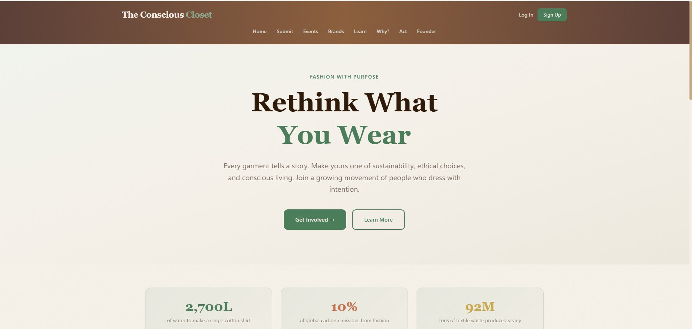

### Submit an Idea
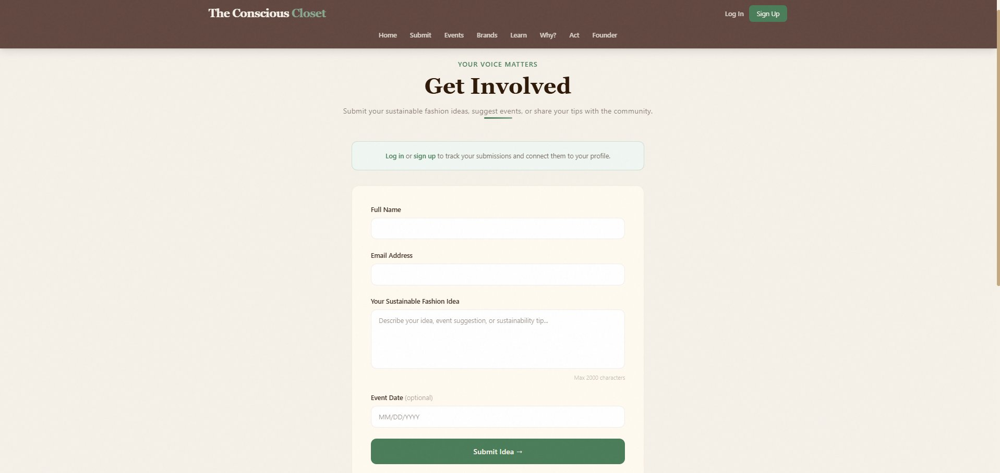

### Events
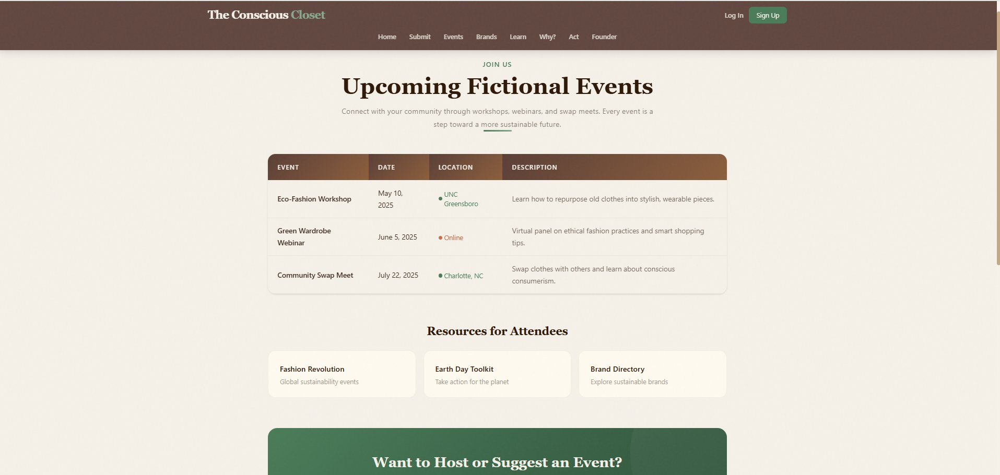

### Sustainable Brands
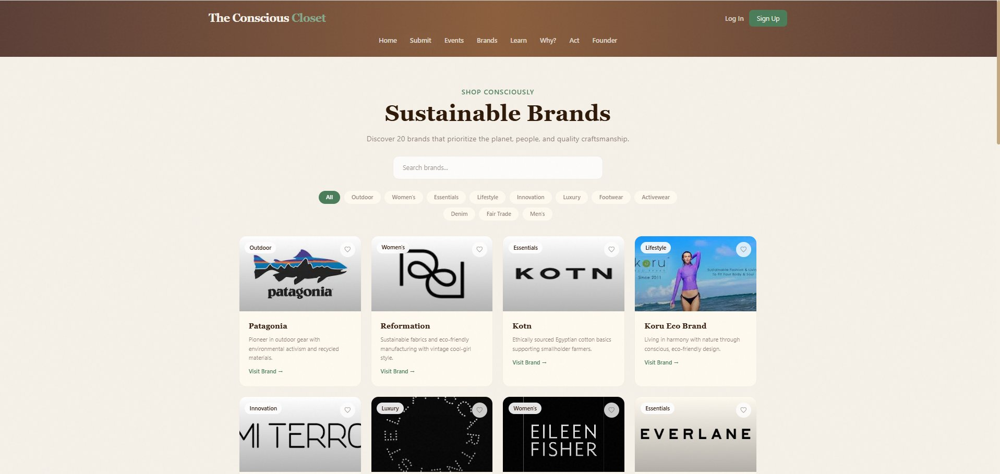

### Sustainability Info
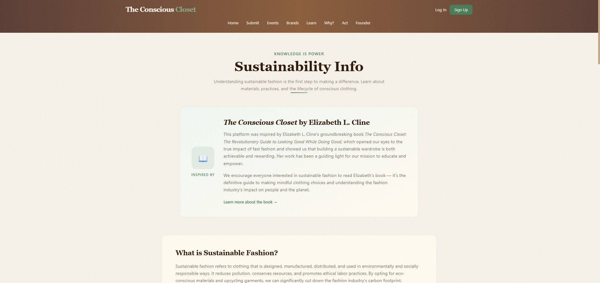

### Why Sustainable Fashion?
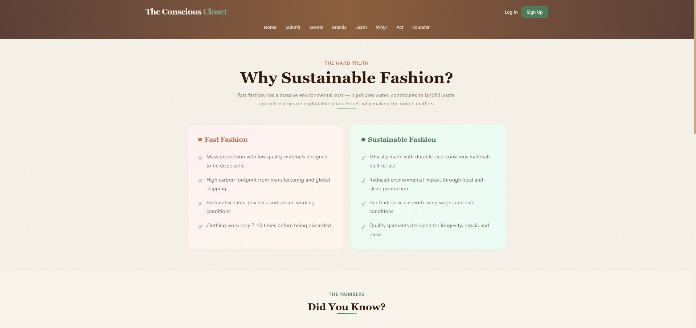

### Take Action
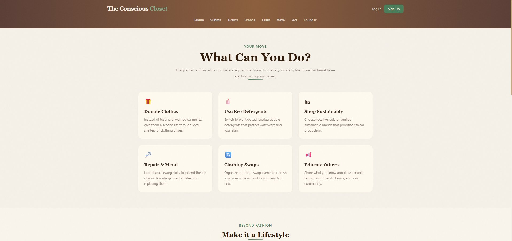

### Log In
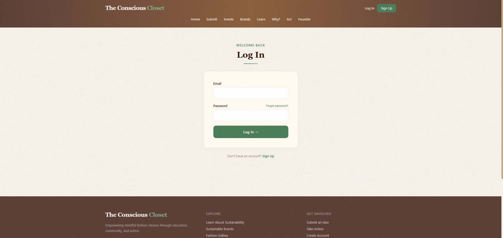

### Sign Up
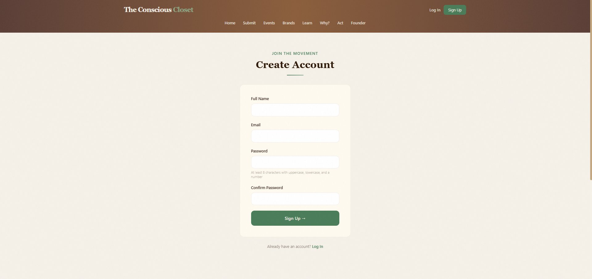

### Profile — Account & Submissions
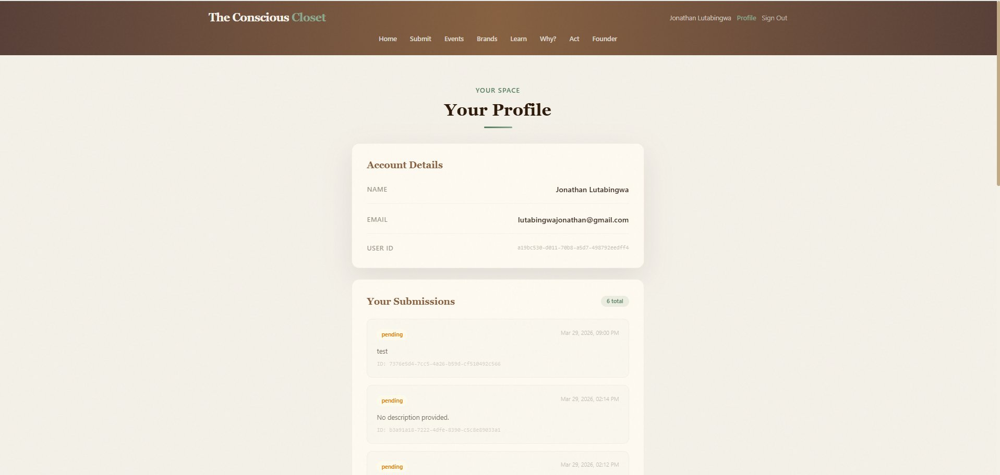

### Profile — Saved Brands
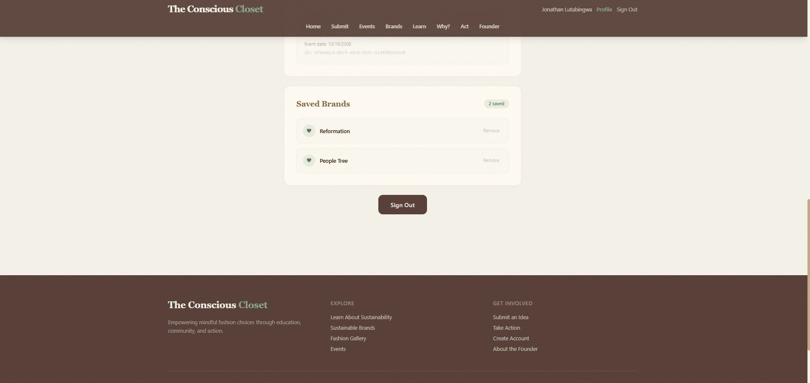

### AWS Infrastructure

### DynamoDB — Submissions Table
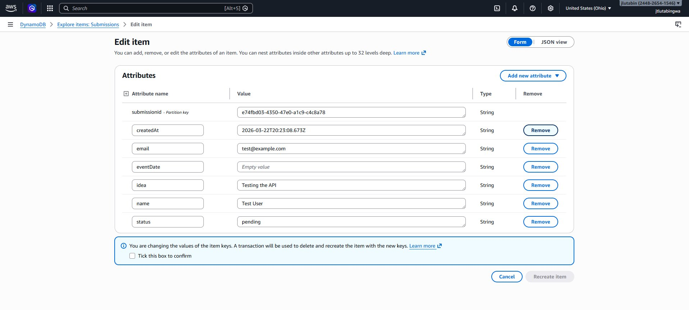

### DynamoDB — Users Table
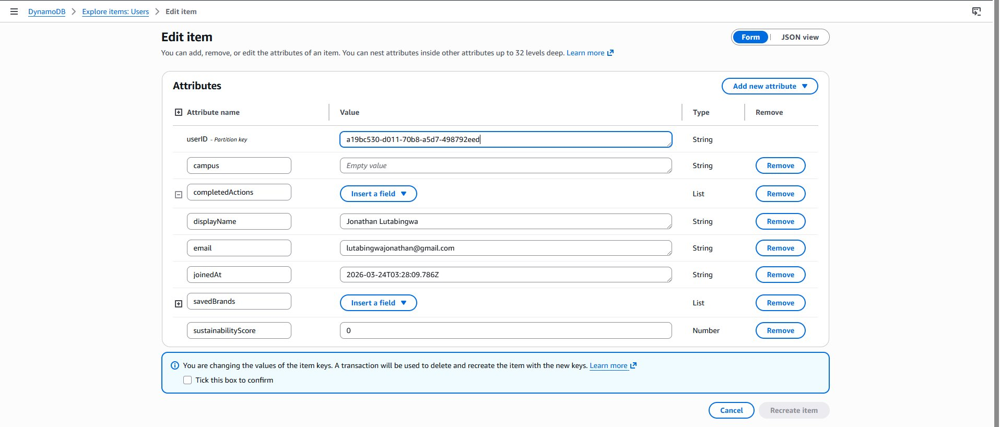

### API Gateway — Routes with JWT Auth
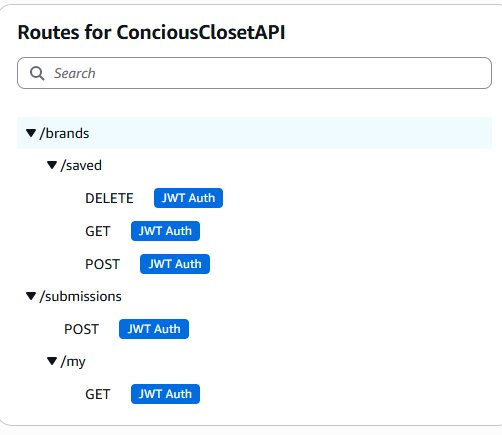
